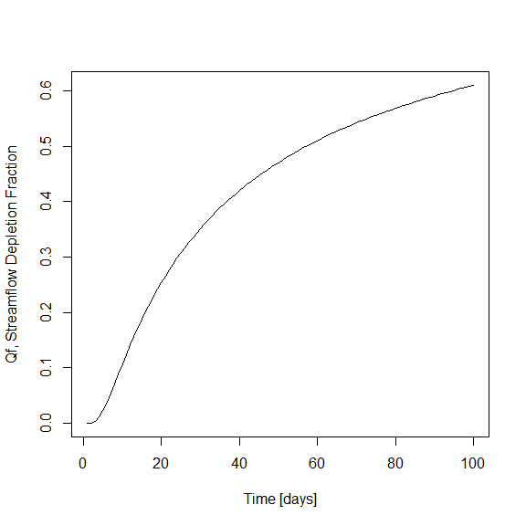

<!-- README.md is generated from README.Rmd. Please edit that file -->

# streamDepletr

[](https://www.tidyverse.org/lifecycle/#experimental)
[](https://travis-ci.org/szipper/streamDepletr)

streamDepletr is an R package with functions for assessing the impacts
of groundwater pumping on streams. There are two primary categories of
functions:

  - Analytical streamflow depletion models, which estimate the change in
    groundwater inputs to a stream resulting from pumping (`hunt`,
    `glover`, `hantush`, `intermittent_pumping`)
  - Depletion apportionment equations, which distribute streamflow
    depletion estimating using the analytical models to different
    reaches within a stream network (`apportion_inverse`,
    `apportion_web`, `apportion_polygon`, `apportion_wedge`)

Combined, these functions will allow the user to estimate the impacts of
an existing or proposed well (or group of wells) on individual stream
reaches within a stream network.

## Installation

You can install streamDepletr from GitHub
with:

``` r
# if you want to build the vignettes, there are several additional packages you'll need
vig.packages<- c("Rmpfr", "dplyr", "magrittr", "knitr", "rmarkdown", "dismo", "sp", "raster", "deldir", "rgeos", "ggplot2", "reshape2", "sf", "scales")
new.packages <- vig.packages[!(vig.packages %in% installed.packages()[,"Package"])]
if(length(new.packages)) install.packages(new.packages)

# install.packages("devtools")  # uncomment if you don't already have devtools
devtools::install_github("szipper/streamDepletr",
                         build_vignettes=T)
```

## Example

Calculate and plot streamflow depletion as a fraction of the pumping
rate (`Qf`) over the 100 days of pumping:

``` r
require(streamDepletr)
#> Loading required package: streamDepletr

# calculate depletion fraction
Qf <- glover(t  = seq(1,100),     # timesteps to evaluate
             d  = 150,            # well to stream distance
             S  = 0.10,           # specific yield
             Tr = 50*1e-5*86400)  # 50 m thick aquifer with hydraulic conductivity of 1e-5 m/s

# plot
plot(seq(1,100), Qf, type="l", xlab="Time [days]", ylab="Qf, Streamflow Depletion Fraction")
```

<!-- -->

For more examples, please check out the package vignette:

`browseVignettes("streamDepletr")`
